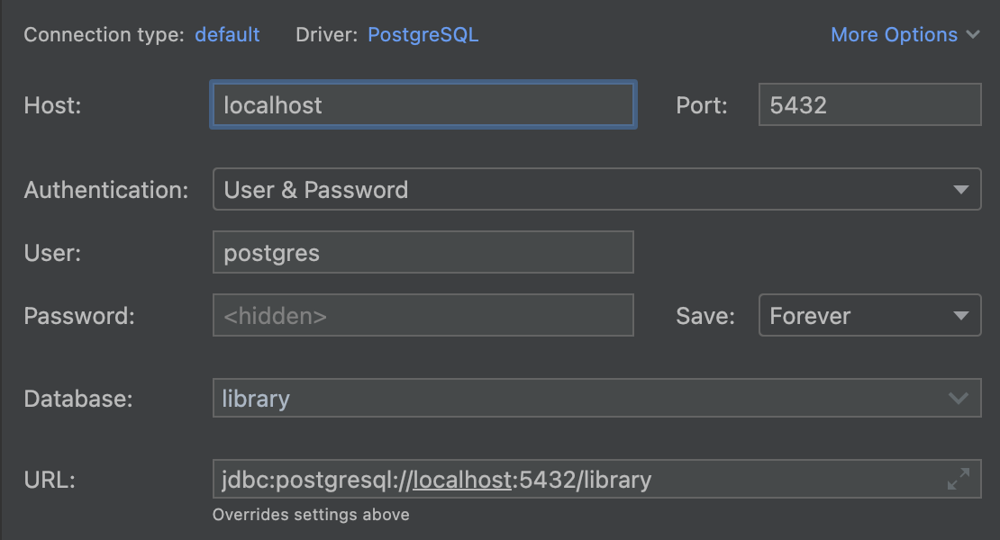

# node-js-test-app

### What does this application do?

This application is a simple Node.js application that retrieves dog facts from 
`https://dog-api.kinduff.com/api/facts?number={number}` and writes these dog facts to a PostgreSQL database table via 
the `/some-endpoint` endpoint.

### How can one run this application locally?

Because everything has been Dockerized, running this application locally is pretty easy! Make sure your machine is 
running Docker (e.g. Docker Desktop), then run

`docker-compose build`

Once the Docker image has been built successfully, run

`docker-compose up`

This will create the PostgreSQL database, create the `dog_facts` table within this database, and start the application
server (which will be available at `http://localhost:8080/`).

### Testing the endpoint

Once the application is running locally, you can test the `/some-endpoint` endpoint with a GET request. Note that this
endpoint uses `number` as a query parameter. If you want three dog facts, for example, you can paste

`http://localhost:8080/some-endpoint?number=3`

into your web browser. The response should look something like this:

```json
[
  "Weird dog laws include allowing police offers in Palding, Ohio, to bite a dog to quiet it. In Ventura County, California, cats and dogs are not allowed to have sex without a permit.",
  "One unspayed female dog, her mate and their puppies can produce 67,000 puppies in six years.",
  "Ancient Egyptians revered their dogs. When a pet dog would die, the owners shaved off their eyebrows, smeared mud in their hair, and mourned aloud for days."
]
```

### Checking the database

Use your favorite database IDE (e.g. DataGrip) to connect to the PostgreSQL database with the following credentials
(note that the password should be `password`):



then `select * from dog_facts`. You should see something like this!


